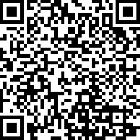

# Nippo Token (testnet)

Nippo (Nihon-ken), is the six native Japanese dog breeds: the Akita Inu, Hokkaido, Kai Ken, Kishu, Shikoku, and Shiba Inu.

## Buy me a beer
0x4Dc6D30c07Fe0E6244377a6adE690901cfde8f79

My address can receive ETH, BNB, ETC and any token.
